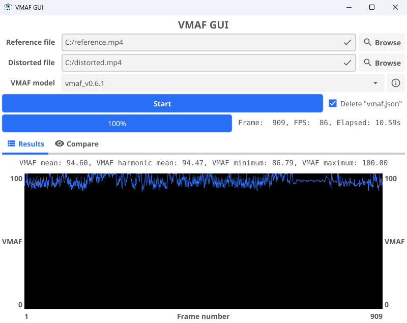
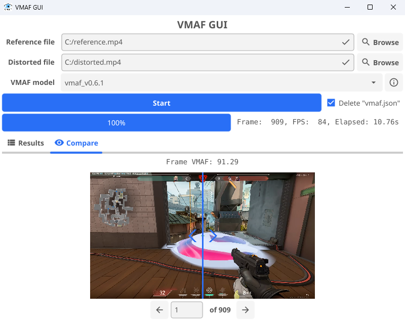

# VMAF GUI

A clean and simple graphical user interface for [Netflix's VMAF](https://github.com/Netflix/vmaf) video comparison algorithm.

VMAF is extremely useful for comparing the perceptual quality of a compressed video to its source/reference, but the command to run it is often long and annoying to write. This program offers a reproducible way of running VMAF for multiple video files, with additional quality-of-life features.

> [!IMPORTANT]
>
> This program requires access to the `ffmpeg` and `ffprobe` commands, which can be downloaded from the [FFmpeg website](https://ffmpeg.org/) and added to the system `PATH` variable. FFmpeg is also required to have `libvmaf` included. A start-up check is performed when this program is launched to ensure it can access these commands.

## Features

- Select `reference` and `distorted` video files to calculate their VMAF score
- Score calculated without decompressing the videos to `yuv` files
  - FFmpeg allows passing the video stream to VMAF without decompressing it to disk first, greatly reducing storage requirements
- Fast CPU-based processing
- Selectable VMAF models (`vmaf_v0.6.1`, `vmaf_4k_v0.6.1`, `vmaf_v0.6.1neg`, `vmaf_4k_v0.6.1neg`)
  - Information button to show details about which model is best suited for which situation
- Live progress updates
- Ability to keep the raw FFmpeg `json` output after the calculation has completed
- Graphing VMAF scores across the duration of the video
  - Hover over the graph to display a tooltip of the hovered frame number and its score
- Compare the same frame between reference and distorted videos with an image slider
  - Enter the desired frame number and move the slider back and forth over the image to transition between reference and distorted frames

## Building

This program is built using the [Go](https://go.dev/) programming language and the [Fyne](https://fyne.io/) UI framework. To setup a development environment, you'll need to install:

- [Go](https://go.dev/)
- A C compiler ([w64devkit](https://github.com/skeeto/w64devkit), [Cygwin](https://cygwin.com/), [MSYS2](https://www.msys2.org/), or similar)
- [Fyne's tooling](https://docs.fyne.io/started/packaging/)
  - Can be installed with `go install fyne.io/tools/cmd/fyne@latest`
- (Optional) [UPX](https://github.com/upx/upx)
  - Fyne projects can be large when compiled. Not necessary, but nice to have

Clone this repository:

```bash
git clone https://github.com/odddollar/VMAF-GUI.git
cd VMAF-GUI
```

Run for testing/development with:

```bash
go run .
```

Package for release with:

```bash
fyne package --release
```

(Optional) Use UPX to transparently compress the executable:

```bash
upx --ultra-brute "VMAF GUI.exe"
```

## Screenshots

<div align="center">
    <br><br>
    
</div>
